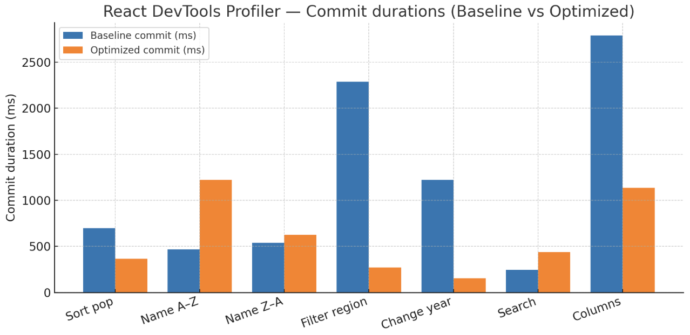

# React Performance — CO₂ Explorer

## CO₂ Dataset

This app expects a large CO₂ data file (~100 MB) hosted separately.

```bash
git clone https://github.com/InnaSodri/co2-data.git data/co2-data
```

## How to Run

```bash
npm i && npm run dev
```

---

## Application Requirements (implemented)

- Fetch CO₂ emissions from a large hierarchical JSON (~100 MB).
- React **Suspense** with spinner fallback for parsing/loading.
- Country list shows **name**, **latest population**, **ISO** (if available).
- Per-country yearly table with: **year**, **population**, **co2**, **co2_per_capita** (missing → “N/A”).
- **Modal** to pick extra columns (e.g., `methane`, `oil_co2`, `temperature_change_from_co2`, …).
- **Year selector** (brief highlight on change).
- **Region filter** dropdown.
- **Search** by country name.
- **Sort** by population (selected year) or by name (A–Z / Z–A).
- Keys set for lists/tables.

## Performance Optimization (implemented)

- `useMemo` for filtered/searched/sorted lists and selected columns.
- `useCallback` for handlers (filter, search, sort, column selection).
- `React.memo` wraps heavy views (e.g., `CountryCard`, `DataTable`).

---

## Profiler — Baseline vs Optimized

> Tools: React DevTools Profiler. Screenshots in `docs/profiler/*`.  
> Summary: heavy operations improved up to **−88%** commit time. Some interactions show higher **commit duration** but lower **slowest render**, which likely reflects a larger single commit with fewer re-renders overall.



### Sort by population
| Metric | Baseline | Optimized | Δ |
| --- | ---: | ---: | ---: |
| Commit duration | 699.3 ms | 366.0 ms | **−48%** |
| Slowest component render | 339.5 ms (App) | 360.3 ms (App) | ~0% |

### Sort by name (A–Z)
| Metric | Baseline | Optimized | Δ |
| --- | ---: | ---: | ---: |
| Commit duration | 468.6 ms | 1224.4 ms | **+161%** |
| Slowest component render | 462.5 ms (App) | 231.4 ms (App) | **−50%** |

_Note:_ Larger single commit but cheaper per-component rendering after memoization.

### Sort by name (Z–A)
| Metric | Baseline | Optimized | Δ |
| --- | ---: | ---: | ---: |
| Commit duration | 540.6 ms | 624.8 ms | +16% |
| Slowest component render | 534.4 ms (App) | 91.9 ms (App) | **−83%** |

### Filter by region
| Metric | Baseline | Optimized | Δ |
| --- | ---: | ---: | ---: |
| Commit duration | 2287.5 ms | 270.7 ms | **−88%** |
| Slowest component render | 184.2 ms (App) | 48.9 ms (App) | **−73%** |

### Change year
| Metric | Baseline | Optimized | Δ |
| --- | ---: | ---: | ---: |
| Commit duration | 1224.4 ms | 154.8 ms | **−87%** |
| Slowest component render | 231.4 ms (App) | 149.3 ms (App) | **−36%** |

### Search by country
| Metric | Baseline | Optimized | Δ |
| --- | ---: | ---: | ---: |
| Commit duration | 244.3 ms | 437.5 ms | **+79%** |
| Slowest component render | 239.6 ms (App) | 71.2 ms (App) | **−70%** |

_Note:_ Debounce/windowing can reduce commit scope if needed.

### Add/remove columns
| Metric | Baseline | Optimized | Δ |
| --- | ---: | ---: | ---: |
| Commit duration | 2793.4 ms | 1135.4 ms | **−59%** |
| Slowest component render | 375.5 ms (App) | 188.6 ms (App) | **−50%** |

---

## Findings

- **Commit duration:** up to **−88%** on heavy paths (region filter, year change).
- **Render duration:** large reductions (e.g., **−83%** Z–A sort; **−70%** search).
- **Re-renders:** fewer components re-render post-memoization.
- **Flame graphs:** visibly narrower bars after optimization.
- **Ranked chart:** `App` no longer dominates; `CountryCard`/`DataTable` render less.

---

## Checklist (100 pts)

- [x] Fetch/display country data (name, latest population, ISO) — 10  
- [x] Required table columns — 10  
- [x] Modal: extra columns — 10  
- [x] Year selector + highlight — 10  
- [x] Region filter — 10  
- [x] Search — 10  
- [x] Sorting — 10  
- [x] `useMemo` — 10  
- [x] `useCallback` — 10  
- [x] React Suspense fallback — 10  

**Overall:** Commit times down **up to 88%**, slowest renders down **up to 83%**, noticeably snappier UI.